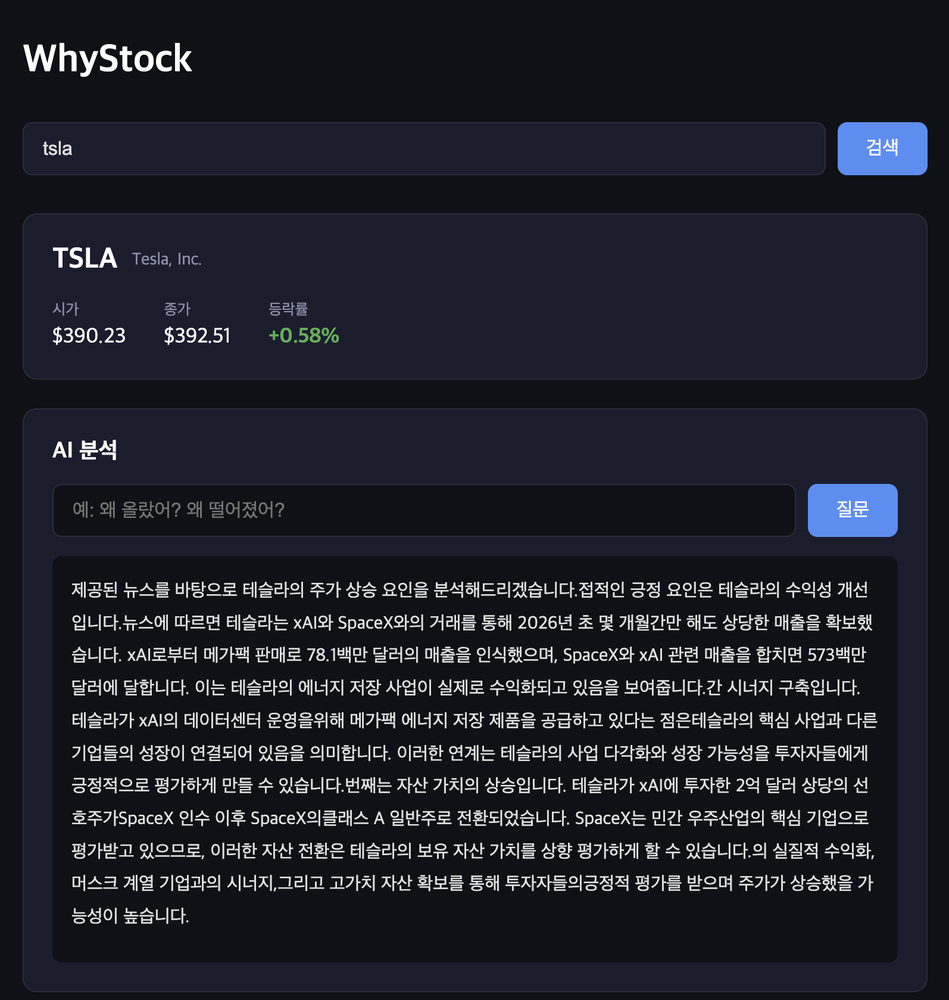

# WhyStock 📈

> "왜 올랐어? 왜 떨어졌어?" — 최신 뉴스 기반 AI 주식 분석 도구

## 프로젝트 소개

WhyStock은 보유 종목의 주가 변동 원인을 최신 뉴스 기반으로 AI가 분석해주는 도구입니다.
단순한 LLM 질의응답이 아닌 **RAG(Retrieval-Augmented Generation)** 구조를 활용해
hallucination을 최소화하고 실제 뉴스 근거 기반의 정확한 답변을 제공합니다.

## RAG 아키텍처


## 기술 스택

**Backend**
- FastAPI — REST API 서버
- PostgreSQL — 주가/뉴스 원본 데이터 저장
- ChromaDB — 벡터 DB (RAG 검색)
- Claude API (claude-haiku-4-5) — LLM 답변 생성
- yfinance — 실시간 주가 데이터 수집
- NewsAPI — 최신 뉴스 수집
- SSE — 실시간 스트리밍 응답

**Frontend**
- React + Vite
- axios
- react-markdown

## 주요 기능

- 티커 입력 시 실시간 주가 데이터 조회 (yfinance)
- 최신 뉴스 자동 수집 및 벡터화 (24시간 갱신)
- RAG 기반 뉴스 검색 → Claude API 연동
- SSE 스트리밍으로 실시간 답변 출력
- 등락률 시각화 (상승/하락 색상 구분)

## 데모



## 실행 방법

### 사전 요구사항
- Python 3.11+
- Node.js 18+
- PostgreSQL

### 환경 변수 설정
```bash
cp .env.example .env
# .env 파일에 API 키 입력
```

### 백엔드 실행
```bash
cd backend
python -m venv venv
source venv/bin/activate
pip install -r requirements.txt
uvicorn app.main:app --reload
```

### 프론트엔드 실행
```bash
cd frontend
npm install
npm run dev
```

### 접속
- Frontend: http://localhost:5173
- API Docs: http://localhost:8000/docs

## 프로젝트 구조

```
whystock/
├── backend/
│   ├── app/
│   │   ├── routers/       # API 엔드포인트
│   │   ├── services/      # 비즈니스 로직
│   │   ├── models/        # DB 모델
│   │   └── core/          # 설정, DB 연결
└── frontend/
    └── src/
        ├── components/    # React 컴포넌트
        └── services/      # API 호출 함수
```
